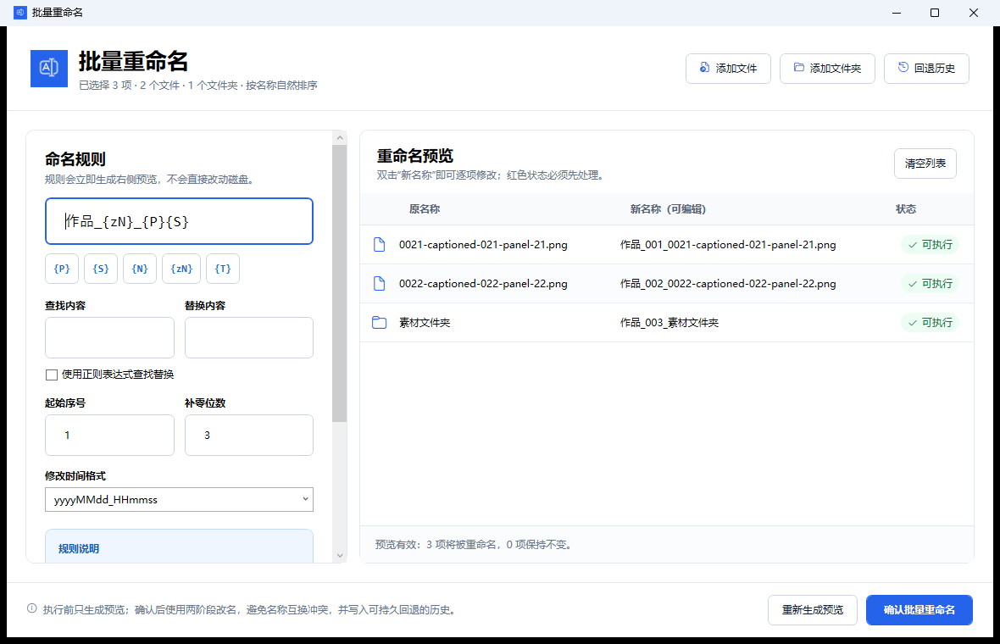

# 浪白重命名工具

面向 Windows 文件资源管理器的批量重命名工具。安装后，多选文件或文件夹并右键即可打开；界面借鉴 MT 管理器的规则能力，并针对桌面端加入完整预览、逐项修改、冲突检查和持久回退。

[下载最新版](https://github.com/2786886095/langbai-batch-renamer/releases/latest) · [查看版本发布](https://github.com/2786886095/langbai-batch-renamer/releases)



## 主要能力

- 文件与文件夹统一按名称自然排序，也能在同一批次内混合处理。
- `{P}` 原名称、`{S}` 扩展名、`{T}` 修改时间、`{N}` 序号、`{zN}` 补零序号。
- 兼容 MT 管理器式 `{0}`、`{1}`、`{z8}` 固定起始序号写法。
- 普通或正则查找替换；替换只作用于 `{P}`，默认保护扩展名。
- 执行前完整预览，可逐项手动修改新名称。
- 无效名称、重复目标和未选中项目占用会阻止执行。
- 两阶段改名避免 A/B 名称互换冲突。
- 最近 50 次操作写入本地历史，关闭工具或重启电脑后仍可回退。
- 快捷键：`Ctrl+O` 添加文件、`Ctrl+Shift+O` 添加文件夹、`F5` 刷新预览、`Ctrl+H` 打开回退历史、`Ctrl+Enter` 执行。

## 右键菜单行为

- Windows 11，纯文件多选或纯文件夹多选：显示在新版首层右键菜单。
- Windows 11，文件和文件夹混合多选：选择“显示更多选项 → 批量重命名”。这是 Windows 11 新版菜单按项目类型匹配扩展命令造成的系统限制；工具本身支持混合批次。
- Windows 10：显示在传统右键菜单。
- 也可以直接打开工具后添加或拖入文件、文件夹。

## 下载与安装

1. 打开 [Releases](https://github.com/2786886095/langbai-batch-renamer/releases/latest)。
2. 下载 `BatchRename-Setup-1.0.0-x64.exe`。
3. 右键安装包并选择“以管理员身份运行”。
4. 安装完成后，在资源管理器中选中文件或文件夹并右键选择“批量重命名”。

当前安装包使用项目本地生成的自签名证书，Windows 可能显示“未知发布者”或 SmartScreen 提示。这不等同于程序被检测为病毒；可以先对照 Release 页面提供的 SHA-256，再决定是否运行。源码和完整构建脚本均公开，后续如使用商业代码签名证书，可消除该发布者警告。

## 兼容性与卸载

支持 64 位 Windows 10 1809 及更高版本、Windows 11。

安装包使用本项目生成的本地自签名证书注册 MSIX 文件资源管理器扩展，因此安装时需要管理员权限。证书只加入本机“受信任人”存储；卸载时会同时移除应用包、菜单注册和该证书。安装向导默认重启一次文件资源管理器，使右键菜单立即生效。

## 构建与验证

需要 .NET 8 SDK、LLVM/LLVM-MinGW、Windows SDK 和 Inno Setup 6。

```powershell
dotnet run --project tests\BatchRename.Tests -c Release
.\scripts\Build-Package.ps1
.\scripts\Test-ExplorerCommand.ps1
```

资源管理器扩展使用原生 `IExplorerCommand` 接收完整的 `IShellItemArray` 多选内容，再将选择交给 WPF 应用。验证脚本也支持传入真实路径，检查 `Invoke` 后应用收到的文件/文件夹数量。
